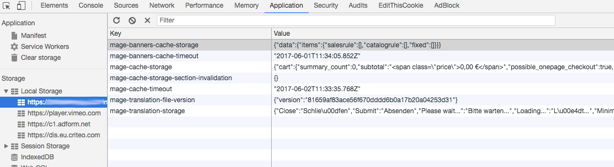
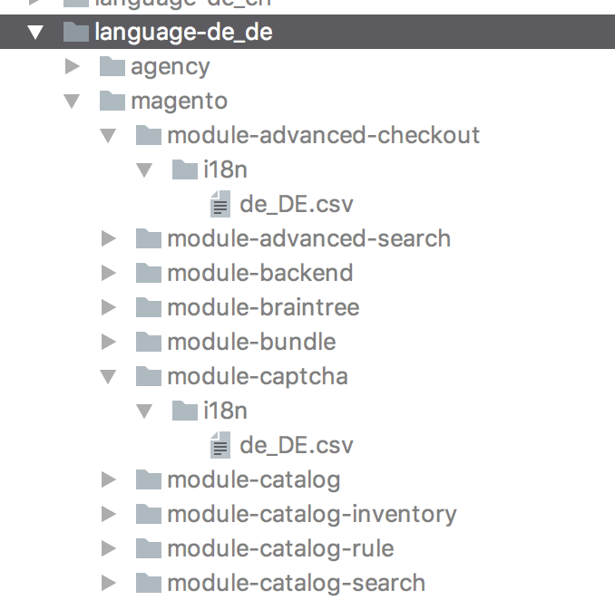
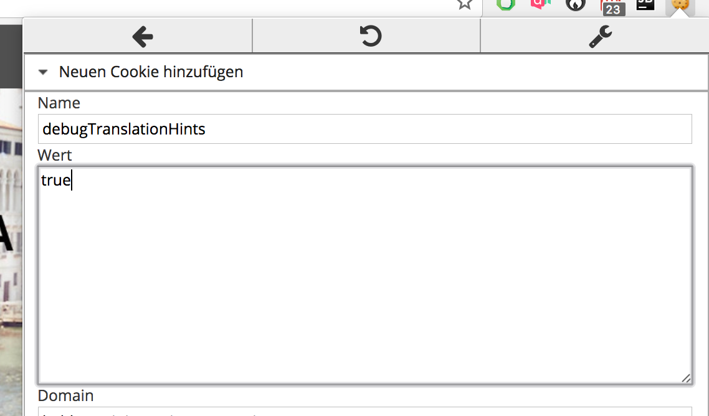
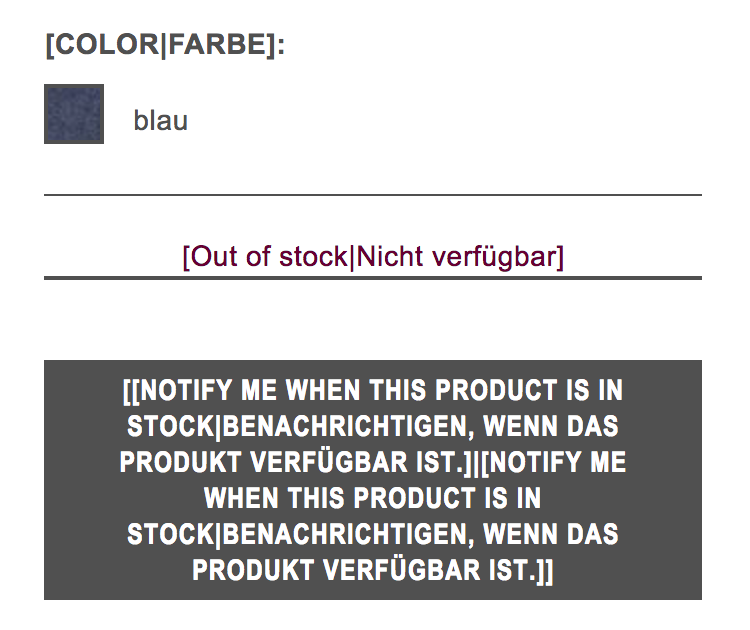
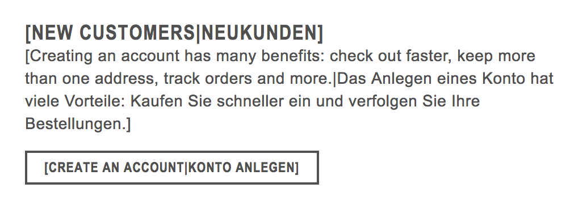

# Magento2 Enhanced Translation

 * Copyright 2017 Shockwave-Design - J. & M. Kramer, all rights reserved.
 * For commercial use: Get a license on www.shockwave-design.de

## Description

This module solves some major problems with Magento2 translation system.

First of all it solves the problem of cached JS-Translation files:
Magento uses a cacheable json file for translations on forms.

These translations are stored in browser application cache:
 

On the one hand this cache follows the idea to push translations to client only a few pageloads -
on the other hand this behavior can produce difficulties for development.
The system uses mage-translation-file-version to determine the need for refreshing the cache.

If you want to change a translation in a js-active form in magento2 
sometimes you have to:

- Delete your browser cache
- Delete your browser application storage
- Flush the fullpage cache of M2
- Flush the block / translation cache of M2

This process is acceptable if you just want to change one single translation,
and your are aware of all these steps. Otherwise you have to debug all these steps 
- just looking for the one step you have missed out to change another translation.

Secondly - although you have managed to go through all your steps to translate your magento2
store to another locale - you have to search for each translation key.

Third - the structure of Magento2 language packages is a real disadvantage:
A language pack does only contain a unordered list of translations in a csv.

This csv is really useful for agency translations and customizations of bought modules by external devs, 
cause its only one file - but there is a catch:

If you have to define module scoped translations, for example for two translations with the same key, 
but different translations its impossible.

    http://devdocs.magento.com/guides/v2.0/frontend-dev-guide/translations/xlate.html

Magento writes about this topic:

    Language packages that contain a entire dictionary in one directory.
    
    You can distribute this language package as a standalone component (similar to modules and themes). Interestingly, it violates Magento’s modularity principles on purpose; that is, so that a system integrator can translations variations provided by extensions.
    
But what to do, if i need both: module structured translations AND one language pack for each locale?

## Features

### Debug cookie

This module enables the frontend-developer to set a cookie, which:
- disables the cache in client web browser, the translation json file is generated every load
- shows not only the translation on frontend, but also the key used

### Language

## Changes of shop behavior

The language pack load procedure is enhanced backward compatible.
It will load existing and enhanced language packs.

## Configuration

#### Create an enhanced language pack

Create a new language pack as documented here:

    http://devdocs.magento.com/guides/v2.0/frontend-dev-guide/translations/xlate.html

Then create a subfolder for each vendor scope you want to override e.g. magento, youragency ...

Create a folder called i18n in it and then a file called like the locale you want to override.

In this csv file you can translate all values as in magento2 default:

    Remove,"Entfernen"
    Cancel,"Abbrechen"
    "Manage Shopping Cart","Warenkorb bearbeiten"
    "Create Order","Neue Bestellung"
    Back,"Zurück"
    "Add Products","Artikel hinzufügen"
    "Update Items and Qty's","Aktualisieren"
    "Are you sure you want to clear your shopping cart?","Sind Sie sicher, dass sie alle Artikel aus dem Warenkorb entfernen möchten?"
    "Clear the shopping cart.","Warenkorb leeren."
    "Add Selected Product(s) to Shopping Cart","Ausgewählte Artikel in den Warenkorb legen"
    "Shopping Cart for %1 in %2","Shopping Cart for %1 in %2"
    "Choose  products to add to shopping cart.","Artikel auswählen, um sie in den Warenkorb zu legen."
    Product,Produkt
    
This module will sort the order of defined modules according to the module dependency list,
read its content and will add it to the result set.

Example:

- module-catalog defines a translation for key/value "Always,Immer"
- module-checkout defines a translation for key/value "Always,Jederzeit"

The current controller scope is module-checkout.

Then all translations are loaded first module-catalog and then as last module: module-checkout,
because its the current scope. Result: "Jederzeit" is displayed.

### Debug cookie

Just do this simple steps:
- deactivate frontend cache for block, translation and full_page
- set a cookie called "debugTranslationHints" and value "true" in your browser

The result should look like this:

All translations used in blocks are enhanced by brackets [] 
and contain key and translation value if given.

## Dependencies to third party

No dependencies to third party modules or services.